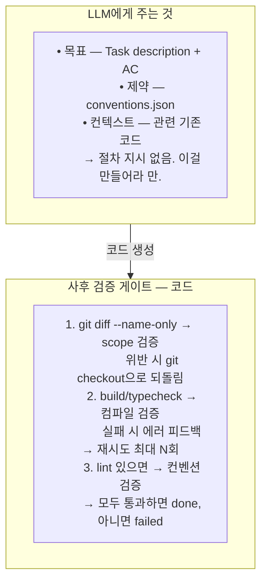

# atlas v3 설계 철학 — 사전 제약에서 사후 검증으로

**작성일:** 2026-03-12
**맥락:** v1-vs-v2 분석 결과를 바탕으로, v3 방향성을 정리한 설계 원칙 문서

---

## 문제의 본질

v2가 풀려고 한 것:

```
LLM이 헛소리함 → 스키마 16개 + Hook 19개 + 상태 5개로 통제
               → 통제 자체가 컨텍스트를 잡아먹음
               → 코드 생성 품질 하락
               → 더 많은 통제가 필요해짐 (악순환)
```

즉 v2는 **사전 제약(pre-constraint)** 전략이다. "LLM이 잘못하기 전에 막겠다."

## 두 가지 전략의 차이

| | v2: 사전 제약 | v3 방향: 사후 검증 |
|--|-------------|---------------|
| 방식 | 하기 전에 경로를 강제 | 하고 나서 결과를 검증 |
| 비유 | 관료제 — 매 단계 결재 | 코드 리뷰 — 결과물을 보고 판단 |
| 비용 | 컨텍스트를 절차에 소비 | 컨텍스트를 생성에 집중 |
| 할루시네이션 대응 | 발생 자체를 방지 (시도) | 발생을 탐지하고 수정 |

## 증거: 과정의 무게가 문제

증거 자체가 문제가 아니다. **증거를 만드는 과정의 무게**가 문제다.

### v2의 증거 생성 과정 (Task 1개)

```
pre-task.sh 실행 → 결과 파싱
pending-to-running.sh 실행 → status.json 기록
[코드 생성]
record-artifacts.sh 실행 → artifacts.json 기록
running-to-validating.sh 실행 → status.json 갱신
run-validation.sh 실행 → validation-result.json 생성
validating-to-reviewing.sh 실행 → status.json 갱신
[자체 리뷰]
reviewing-to-completed.sh 실행 → status.json 갱신 + git commit
post-task.sh 실행 → evidence 기록
```

**9번의 Bash 호출, 4번의 status.json 갱신, 3개의 JSON 파일 생성.** 이게 전부 컨텍스트에 쌓인다.

### v3의 증거: 생성물 자체가 증거

```
[코드 생성]
→ git diff              ← 뭘 만들었는지 (artifact)
→ build/typecheck 실행   ← 컴파일되는지 (validation)
→ 결과 판정              ← done / failed
```

**증거 = git diff + 빌드 결과.** 별도 JSON 파일이 아니라 코드 자체와 빌드 로그가 증거다. v1이 `atlas.py scope`로 했던 것처럼.

## 할루시네이션 유형별 대응

### 유형 1 — 없는 파일/클래스를 참조

```
v2: expected_files 스키마로 사전에 경로 고정
v3: 빌드가 실패함 → import error → 즉시 탐지
```

**빌드가 가장 정직한 검증기다.** 16개 스키마보다 `compileJava` 한 번이 더 확실하다.

### 유형 2 — 컨벤션 위반 (네이밍, 패턴)

```
v2: conventions.json 스키마 강제 + Hook으로 검증
v3: conventions.json은 유지 (입력), 사후에 lint/기존코드 diff로 검증
```

conventions.json 자체는 좋다. 문제는 이걸 전달하는 방식이다. v2는 스키마 검증 Hook으로 conventions.json의 "형식"을 검증하는 데 시간을 쓰지만, 정작 LLM이 생성한 코드가 컨벤션을 따르는지는 자체 리뷰에 맡긴다.

### 유형 3 — Scope 이탈 (관계없는 파일 수정)

```
v2: file-policy.json + check-file-policy.sh 가드 (매 Write마다)
v3: 생성 후 git diff --name-only로 scope 검증 1회
    위반 시 git checkout으로 되돌림 (v1 방식)
```

v1이 이미 해결했던 방법이다. 매번 가드를 호출하는 대신, 결과를 보고 위반을 되돌린다.

### 유형 4 — AC 미충족

```
v2: acceptance_criteria를 task.json에 내장 → 자체 리뷰에서 status 갱신
v3: AC를 프롬프트로 전달 → 생성 후 AC 체크리스트 대조 (LLM 자체)
    + 빌드 성공 여부로 기능적 검증
```

솔직히 v2도 AC 검증은 LLM 자체 리뷰다. JSON status를 갱신하는 절차만 추가된 것이지 검증 주체는 같다.

## v3의 할루시네이션 방어 구조



**스크립트는 3개 게이트만 담당한다.** 분석, 분해, 계획, 상태 전이는 하지 않는다.

## 핵심 인사이트

> v2는 "LLM이 실수하지 않게 **과정을 통제**"하려 했고,
> v3는 "LLM이 실수하면 **결과에서 탐지**"하는 방향이다.

빌드 실패, scope 위반, lint 에러 — 이것들은 거짓말을 못 한다. 16개 스키마의 형식 검증보다 `./gradlew compileJava`의 exit code가 더 신뢰할 수 있는 증거다.

## 아키텍처 패턴: Harness

v3는 **Harness(하네스)** 패턴을 따른다.

테스트 하네스가 테스트 코드의 내부 로직을 통제하지 않듯, atlas v3의 하네스도 LLM의 코드 생성 방식을 통제하지 않는다. 양 끝(setup / validate)만 잡고, 가운데는 놔둔다.

```
Harness:  setup → [ LLM 자유 실행 ] → validate → teardown
          ^^^^^                        ^^^^^^^^
        스크립트 영역                스크립트 영역
                  ^^^^^^^^^^^^^^^^^
                  LLM 영역 (터치 안 함)
```

| | v2: Orchestrator | v3: Harness |
|--|-----------------|-------------|
| 역할 | 매 단계를 지시하고 상태를 추적 | 양 끝만 잡고 가운데는 놔둠 |
| 스크립트 위치 | 실행 흐름 전체에 분산 (19개) | 입구와 출구에만 집중 (3개 게이트) |
| LLM 자유도 | 절차 준수에 컨텍스트 소비 | 코드 생성에 컨텍스트 집중 |
| 실패 대응 | 상태 전이 오류 디버깅 | 빌드 실패 → 피드백 → 재시도 |

### Harness의 3가지 책임

1. **Setup** — 입력 준비 (티켓 fetch, conventions 로드, 기존 코드 컨텍스트)
2. **Validate** — 출력 검증 (scope 체크, 빌드, lint)
3. **Teardown** — 정리 (커밋, 상태 기록)

이 외의 모든 것(분석, 분해, 계획, 코드 생성)은 LLM이 자유롭게 수행한다.

## v3 설계 원칙 요약

| 원칙 | 설명 |
|------|------|
| Harness 패턴 | setup → LLM 자유 실행 → validate. 가운데를 통제하지 않는다 |
| 목표와 제약만, 절차 최소화 | Task의 goal + constraints만 전달, 생성은 LLM 자유 |
| 정형 작업만 스크립트로 | fetch만 스크립트, 분해/계획은 LLM |
| 상태 2~3개 | `pending → done / failed` |
| 강제 제어는 사후 검증 코드로 | scope 검증, 빌드, lint — 3개 게이트 |
