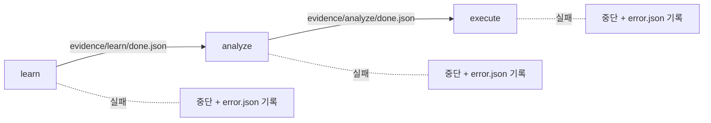
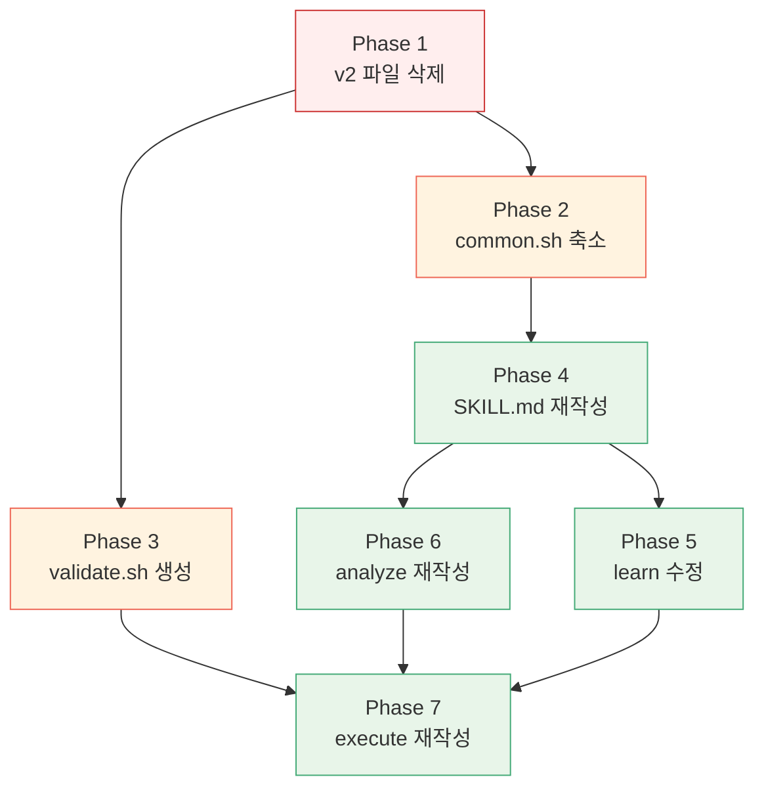

# atlas v3 구현 계획

**작성일:** 2026-03-13
**기반 문서:** [v3-design-philosophy.md](v3-design-philosophy.md), [v1-vs-v2-analysis.md](v1-vs-v2-analysis.md)
**브랜치:** `rio/atlas-v3` (v2 `b2de814`에서 분기)

---

## 1. 목표

v2의 Orchestrator 아키텍처를 **Harness 아키텍처**로 전환한다.

```
v2: 스키마 16개 + Hook 19개 + Python 4개 + 상태 5개 = ~850줄 프롬프트
v3: 스키마 1개 + 스크립트 2개 + 상태 2개 = 목표 ~300줄 프롬프트
```

## 2. 아키텍처 개요

```
Harness:  setup → [ LLM 생성 ] → [ LLM 레드팀 ] → validate.sh → teardown
                   ^^^^^^^^^^^    ^^^^^^^^^^^^^    ^^^^^^^^^^^
                   자유 실행       내용 검증         코드 검증
```

| 단계 | 책임 | 담당 |
|------|------|------|
| **Setup** | 티켓 fetch, conventions 로드, 기존 코드 컨텍스트 준비 | 스크립트 1개 (`fetch-ticket.py`) + LLM |
| **LLM 생성** | 분석, 분해, 계획, 코드 생성 — 전부 | LLM |
| **LLM 레드팀** | 생성물의 내용 검증 (누락, 의존성, AC, 컨벤션) | LLM (비판적 관점) |
| **Validate** | scope 검증, 빌드, lint — 코드 레벨 검증 | 스크립트 1개 (`validate.sh`) |
| **Teardown** | 커밋, 결과 기록 | LLM |

### 2.1 레드팀 계층

v2는 스키마로 **형식**을 검증했지만 **내용**은 못 잡았다. v3는 레드팀으로 **내용**을 검증한다.

| 검증 대상 | v2 (스키마) | v3 validate.sh | v3 레드팀 |
|-----------|-----------|----------------|----------|
| JSON 형식 오류 | O | - | - |
| 컴파일 오류 | - | **O** | - |
| scope 이탈 | - | **O** | - |
| lint 위반 | - | **O** | - |
| Task 분해 누락 | **X** (형식만 검증) | - | **O** |
| 의존성 순서 오류 | **X** (DAG 형식만) | - | **O** |
| AC 미충족 | **X** (LLM 자체 리뷰) | - | **O** |
| 컨벤션 위반 (lint 못 잡는) | **X** | - | **O** |

**역할 분리:** validate.sh는 "코드가 돌아가는가", 레드팀은 "코드가 맞는가"를 검증한다.

### 2.2 레드팀 적용 시점

**시점 1 — analyze 후 (Task 분해 레드팀)**
```
LLM이 tasks.json 생성
→ 레드팀: "source.json 대비 빠진 Task? 의존성이 맞는가? 파일 경로가 실존하는가?"
→ 문제 발견 시 tasks.json 수정
→ 통과 시 execute 진행
```

**시점 2 — execute 중 Task별 (코드 생성 레드팀)**
```
Task별 코드 생성 완료
→ 레드팀: "AC 충족? conventions 준수? 불필요한 코드?"
→ 문제 발견 시 코드 수정
→ 통과 시 validate.sh → commit
```

### 2.3 레드팀 프롬프트 원칙

레드팀은 별도 스크립트가 아니라 **SKILL.md에 내장된 프롬프트 지시**다:

- "생성한 결과를 비판적으로 검토하라"
- 구체적 체크리스트를 제시 (누락, 의존성, AC, 컨벤션)
- 문제 발견 시 직접 수정하고 수정 사항을 출력
- 별도 Bash 호출 없음 — LLM의 추론 과정에서 수행

이렇게 하면:
- **추가 컨텍스트 비용:** 체크리스트 프롬프트 ~20줄
- **추가 Bash 호출:** 0회
- **효과:** v2의 스키마 16개가 못 잡던 내용 검증을 수행

## 3. v2 → v3 파일 마이그레이션 맵

### 3.1 삭제 대상 (v2 전용)

v2에서 Orchestrator를 위해 존재했던 파일들. v3에서는 전부 불필요하다.

**hooks/edges/ (5개) — 전체 삭제**
```
hooks/edges/failed-to-pending.sh
hooks/edges/pending-to-running.sh
hooks/edges/reviewing-to-completed.sh
hooks/edges/running-to-validating.sh
hooks/edges/validating-to-reviewing.sh
```
이유: 5상태 모델 제거. v3는 `pending → done / failed`만 사용하며, 상태 전이 자체를 스크립트가 관리하지 않는다.

**hooks/lifecycle/ (2개) — 전체 삭제**
```
hooks/lifecycle/post-task.sh
hooks/lifecycle/pre-task.sh
```
이유: Task 실행 전후 hook이 필요 없다. validate.sh가 사후 검증을 대체한다.

**hooks/pre-step/ (3개) — 전체 삭제**
```
hooks/pre-step/pre-analyze.sh
hooks/pre-step/pre-execute.sh
hooks/pre-step/pre-plan.sh
```
이유: 이전 스텝 증거 확인 로직. v3는 증거 파일 체인 대신 산출물 존재 여부를 LLM이 직접 확인한다.

**hooks/post-step/ (4개) — 전체 삭제**
```
hooks/post-step/post-analyze.sh
hooks/post-step/post-execute.sh
hooks/post-step/post-learn.sh
hooks/post-step/post-plan.sh
```
이유: 스키마 검증 + 증거 파일 생성 로직. v3는 빌드 성공이 증거이다.

**hooks/guard/ (2개) — 삭제**
```
hooks/guard/check-file-policy.sh
hooks/guard/file-policy.json
```
이유: 매 Write마다 호출하는 사전 제약. v3는 사후에 `git diff --name-only`로 scope를 검증한다.

**hooks/config.json — 삭제**

**schemas/ (16개) — 대부분 삭제**
```
삭제:
  dependency-graph.schema.json      — LLM이 자유 형식으로 의존성을 판단
  evidence-event.schema.json        — 증거 파일 체인 제거
  execution-plan.schema.json        — Wave 기반 실행 계획 제거
  jira-ticket.schema.json           — fetch 결과 형식을 LLM이 직접 해석
  policy-registry.schema.json       — Policy 추적 레지스트리 제거
  ralph-loop.schema.json            — 사용 안 함
  step-evidence-ref.schema.json     — 증거 참조 제거
  step-evidence.schema.json         — 증거 파일 제거
  task-artifacts.schema.json        — artifacts.json 제거
  task-git.schema.json              — git 메타 제거
  task-meta.schema.json             — LLM이 자유 형식으로 Task 정의
  task-status.schema.json           — 2상태로 단순화, 스키마 불필요
  transition-log.schema.json        — 상태 전이 로그 제거
  validation-result.schema.json     — 빌드 exit code가 검증 결과
  workflow-state.schema.json        — 워크플로우 상태 제거

유지 + 이동:
  conventions.schema.json           → schemas/learn/conventions.schema.json
```

**skills/analyze/scripts/ (2개) — 1개 삭제, 1개 유지**
```
삭제: decompose-tasks.py            — LLM이 직접 분해
유지: fetch-ticket.py               — Jira API 호출은 정형 작업 (Setup 역할)
```

**skills/execute/scripts/ (3개) — 전체 삭제**
```
load-wave-plan.py                   — Wave 기반 실행 계획 로더 제거
record-artifacts.sh                 — artifacts.json 기록 제거
run-validation.sh                   — validate.sh로 통합
```

**skills/plan/ — 전체 삭제**
```
skills/plan/SKILL.md
skills/plan/scripts/generate-plan.py (존재한다면)
```
이유: DAG 위상 정렬 + Wave 배치는 v2의 과잉 엔지니어링. LLM이 의존성을 파악하고 순서를 결정한다.

**skills/analyze/references/ (2개) — 삭제**
```
references/field-rules.md
references/policy-registry-rules.md
```
이유: v2의 task-plan.json 필드 규칙. v3는 LLM이 자유 형식으로 Task를 정의한다.

**references/ — 일부 삭제**
```
삭제: hook-architecture.md          — Hook 아키텍처 제거
삭제: convention-layers.md          — Layer 0~4 규칙 (conventions.json 자체는 유지하되, 레이어 개념 삭제)
유지: v1-vs-v2-analysis.md          — 역사적 참조
유지: v3-design-philosophy.md       — 설계 철학
유지: v3-implementation-plan.md     — 이 문서
```

**scripts/validate-schema.sh — 삭제**
이유: 스키마 검증 인프라 제거.

### 3.2 유지 대상

| 파일 | 역할 | 변경 사항 |
|------|------|-----------|
| `SKILL.md` | 메인 라우터 | **전면 재작성** — Harness 기반 |
| `scripts/common.sh` | 공유 헬퍼 | **대폭 축소** — run 관리 + env 로드만 유지 |
| `schemas/conventions.schema.json` | conventions 구조 정의 | `schemas/learn/`로 이동 |
| `skills/learn/SKILL.md` | 컨벤션 학습 | **소폭 수정** — post-step hook 호출 제거 |
| `skills/analyze/SKILL.md` | 티켓 분석 | **전면 재작성** — fetch만 스크립트, 나머지 LLM |
| `skills/analyze/scripts/fetch-ticket.py` | Jira API 호출 | 유지 (변경 없음) |
| `skills/execute/SKILL.md` | 코드 생성 | **전면 재작성** — Harness 패턴 |

### 3.3 신규 생성

| 파일 | 역할 |
|------|------|
| `scripts/validate.sh` | 사후 검증 게이트 — scope + 빌드 + lint |
| `schemas/learn/conventions.schema.json` | 기존 파일 이동 |
| `schemas/analyze/tasks.schema.json` | tasks.json 구조 정의 |
| `schemas/evidence/script-result.schema.json` | 스크립트 실행 성공 기록 |
| `schemas/evidence/script-error.schema.json` | 스크립트 실행 오류 기록 |
| `schemas/evidence/llm-decision.schema.json` | LLM 결정 기록 |
| `schemas/evidence/redteam.schema.json` | 레드팀 검토 기록 |
| `schemas/evidence/commit.schema.json` | 커밋 기록 |
| `schemas/evidence/step-done.schema.json` | Step 완료 마커 (엣지 조건) |

## 4. 수치 목표 (v2 → v3)

| 항목 | v2 | v3 목표 | 감소율 |
|------|----|---------|----|
| 프롬프트 총 줄 수 | ~850줄 | ~300줄 | -65% |
| Python 스크립트 | 4개 (1,500줄+) | 1개 (fetch-ticket.py) | -75% |
| Shell 스크립트 | 19개 | 2개 (common.sh, validate.sh) | -89% |
| 스키마 파일 | 16개 (플랫) | 9개 (폴더 구조화) | -44% |
| 상태 모델 | 5상태 + hook 체인 | 2상태 (pending/done) | -60% |
| Task당 Bash 호출 | 9회+ | 1회 (validate.sh) | -89% |

## 5. 단계별 구현 계획

### Phase 1 — 정리 (삭제)

v2 전용 파일을 제거하여 v3의 출발점을 깨끗하게 만든다.

**작업:**
1. `hooks/` 디렉토리 전체 삭제 (edges, lifecycle, pre-step, post-step, guard, config.json)
2. `schemas/` 에서 conventions.schema.json을 제외한 15개 파일 삭제
3. `scripts/validate-schema.sh` 삭제
4. `skills/plan/` 디렉토리 전체 삭제
5. `skills/analyze/scripts/decompose-tasks.py` 삭제
6. `skills/analyze/references/` 디렉토리 전체 삭제
7. `skills/execute/scripts/` 디렉토리 전체 삭제
8. `references/hook-architecture.md`, `references/convention-layers.md` 삭제

**완료 조건:** 남은 파일이 아래와 정확히 일치
```
SKILL.md
schemas/conventions.schema.json
scripts/common.sh
skills/learn/SKILL.md
skills/analyze/SKILL.md
skills/analyze/scripts/fetch-ticket.py
skills/execute/SKILL.md
references/v1-vs-v2-analysis.md
references/v3-design-philosophy.md
references/v3-implementation-plan.md
```

### Phase 2 — common.sh 축소

v2의 상태 관리/Hook 실행 로직을 제거하고, 필수 기능만 남긴다.

**유지하는 함수:**
- `load_env` — .env 로드
- `_init_paths` — PROJECT_ROOT, AUTOMATION_PATH 초기화
- `resolve_run` — 활성 run 조회
- `create_run` — 새 run 생성
- `run_dir_path` — run 디렉토리 경로
- `log_info`, `log_warn`, `log_error` — 로그 출력
- `now_iso` — ISO 타임스탬프
- `ensure_automation_dir` — 디렉토리 초기화

**삭제하는 함수:**
- `task_dir`, `task_meta`, `task_status`, `task_artifacts` — v2 Task 디렉토리 구조 헬퍼
- `read_task_status`, `update_status` — 5상태 모델 관련
- `run_hook` — Hook 실행기
- `validate_json` — 스키마 검증
- `gen_task_id` — TASK-hex ID 생성
- `now_ms` — 밀리초 타임스탬프

### Phase 3 — validate.sh 신규 생성

사후 검증 게이트. Task 실행 후 한 번만 호출한다.

```bash
#!/usr/bin/env bash
# 사용법: validate.sh --scope "file1.java file2.java" [--build "cmd"] [--lint "cmd"]
# exit 0: 모든 게이트 통과
# exit 1: scope 위반 (위반 파일 목록 출력)
# exit 2: 빌드 실패 (에러 로그 출력)
# exit 3: lint 실패 (에러 로그 출력)
```

**Gate 1 — Scope 검증**
- `git diff --name-only`로 변경된 파일 목록 추출
- `--scope`로 전달받은 허용 파일 목록과 비교
- 허용 목록에 없는 파일이 변경되었으면 → `git checkout -- <file>` 로 되돌리고 exit 1
- `.automation/` 하위는 항상 허용

**Gate 2 — 빌드 검증**
- `--build` 인자가 있으면 해당 커맨드 실행
- 없으면 `conventions.json`의 `commands.build`를 읽어서 실행
- exit code != 0 → stderr 출력 후 exit 2

**Gate 3 — Lint 검증**
- `--lint` 인자가 있으면 해당 커맨드 실행
- 없으면 `conventions.json`의 `commands.lint`를 읽어서 실행
- lint 커맨드가 없으면 (null) → 스킵
- exit code != 0 → stderr 출력 후 exit 3

### Phase 4 — SKILL.md 재작성 (메인 라우터)

v2의 291줄을 ~100줄로 축소한다.

**구조:**

```markdown
# Atlas v3

Jira 티켓 → 코드 자동 생성. Harness 패턴: setup → LLM 자유 실행 → validate.

## 사용법
/atlas TICKET-KEY     — 전체 파이프라인
/atlas learn          — 컨벤션 학습
/atlas TICKET-KEY execute — 분석+실행만 (learn 스킵)

## 전체 파이프라인 (TICKET-KEY)

### 1. Setup
- load_env로 환경 로드
- conventions.json 확인 (없으면 learn 실행)
- fetch-ticket.py로 Jira 티켓 수집 → source.json

### 2. LLM 자유 실행
- source.json을 읽고 Task를 분해한다
- Task 간 의존성을 파악하고 실행 순서를 정한다
- Task별로 코드를 생성한다
- conventions.json의 규칙을 따른다

### 3. Validate
- Task별로 validate.sh를 실행한다
- 실패 시 에러 피드백을 받고 수정한다 (최대 3회)

### 4. Teardown
- Task별로 git commit
- 결과 요약 출력

## 투명성 정책
(기존 유지 — 오류 보고, 스크립트 임의 수정 금지)

## 파일 구조
(v3 구조 반영)
```

### Phase 5 — skills/learn/SKILL.md 수정

**변경 사항:**
- post-learn Hook 호출 제거 (검증 + 증거 생성 섹션)
- conventions.json 생성 후 직접 `jq` 또는 LLM이 구조를 확인
- 증거 파일(`.automation/evidence/learn.validated.json`) 생성 제거
- conventions.json 존재 자체가 learn 완료의 증거

### Phase 6 — skills/analyze/SKILL.md 재작성

**v2 흐름 (7단계):**
```
pre-analyze.sh → run 결정 → fetch-ticket.py → decompose-tasks.py (scaffold)
→ LLM이 task-plan.json 작성 → LLM이 policy-registry.json 작성
→ decompose-tasks.py (스캐폴딩) → post-analyze.sh
```

**v3 흐름 (4단계):**
```
1. run 결정 (common.sh)
2. fetch-ticket.py → source.json
3. LLM이 source.json을 읽고 Task를 분해 → ${RUN_DIR}/tasks.json에 기록
4. 레드팀: source.json 대비 tasks.json 검증 → 문제 시 수정
```

**핵심 변경:**
- `decompose-tasks.py` 제거 — LLM이 직접 분해
- `policy-registry.json` 제거 — Policy는 Task 설명에 포함
- `tickets/` 계층형 디렉토리 제거 — source.json을 LLM이 직접 읽음
- `dependency-graph.json` 제거 — LLM이 의존성을 자체 판단
- `task-plan.json` 제거 — LLM이 자유 형식으로 Task 목록 작성

**tasks.json 형식 (자유롭되 최소 구조):**
```json
{
  "ticket_key": "GRID-2",
  "tasks": [
    {
      "id": "1",
      "title": "Point 엔티티 생성",
      "description": "포인트 적립/차감을 위한 JPA 엔티티",
      "files": ["server/core/src/.../Point.java", "server/core/src/.../PointType.java"],
      "depends_on": [],
      "ac": ["MUST: id, memberId, amount, type, createdAt 필드", "SHOULD: soft delete"],
      "status": "pending"
    }
  ]
}
```

### Phase 7 — skills/execute/SKILL.md 재작성

**v2 흐름 (198줄):**
```
pre-execute → load-wave-plan.py → conventions 로드
→ Wave 순회 → Task별 (Phase 1-2-3 × Hook 9회) → post-execute
```

**v3 흐름 (~80줄):**
```
1. tasks.json 로드 + conventions.json 로드
2. Task 순회 (의존성 순서대로)
   각 Task:
   a. task 설명 + AC + conventions를 컨텍스트로 코드 생성
   b. 레드팀: AC 충족? conventions 준수? 불필요한 코드? → 문제 시 수정
   c. validate.sh 실행
   d. 실패 시 에러 피드백 → 수정 (최대 3회)
   e. 성공 시 git commit + status를 "done"으로 갱신
3. 결과 요약 출력
```

**핵심 변경:**
- Wave/병렬 실행 제거 — 순차 실행. 병렬은 필요해지면 나중에 추가
- Phase 1-2-3 구분 제거 — "코드 생성 → validate → 커밋" 단일 루프
- Hook 호출 전부 제거 — validate.sh 한 번만
- Task당 Bash 호출: 9회+ → 1회

## 6. v3 최종 파일 구조

```
.claude/skills/atlas/
├── SKILL.md                                    ← 메인 라우터 (~100줄)
│
├── schemas/                                    ← 용도별 폴더 구조화
│   ├── learn/
│   │   └── conventions.schema.json             ← conventions.json 구조
│   ├── analyze/
│   │   └── tasks.schema.json                   ← tasks.json 구조
│   └── evidence/
│       ├── script-result.schema.json           ← 스크립트 성공 기록
│       ├── script-error.schema.json            ← 스크립트 오류 기록
│       ├── llm-decision.schema.json            ← LLM 결정 기록
│       ├── redteam.schema.json                 ← 레드팀 검토 기록
│       ├── commit.schema.json                  ← 커밋 기록
│       └── step-done.schema.json               ← Step 완료 마커
│
├── scripts/
│   ├── common.sh                               ← env 로드 + run 관리 (~80줄)
│   └── validate.sh                             ← 사후 검증 게이트 (신규, ~80줄)
│
├── skills/
│   ├── learn/
│   │   └── SKILL.md                            ← 컨벤션 학습 (~100줄)
│   ├── analyze/
│   │   ├── SKILL.md                            ← 티켓 분석 (~60줄)
│   │   └── scripts/
│   │       └── fetch-ticket.py                 ← Jira API 호출 (유지)
│   └── execute/
│       └── SKILL.md                            ← 코드 생성 (~80줄)
│
└── references/
    ├── v1-vs-v2-analysis.md                    ← 역사적 참조
    ├── v3-design-philosophy.md                 ← 설계 철학
    └── v3-implementation-plan.md               ← 이 문서
```

**파일 수:** 52개 → 19개
**스크립트:** 23개 → 3개 (common.sh + validate.sh + fetch-ticket.py)
**스키마:** 16개 (플랫) → 9개 (3폴더 구조화: learn / analyze / evidence)

## 7. 산출물 디렉토리 구조 (v3)

```
PROJECT_ROOT/.automation/
├── conventions.json                          ← learn 산출물
├── runs.json                                 ← run 레지스트리
└── runs/{TICKET_KEY}-{hash8}/
    ├── source.json                           ← fetch-ticket.py 원본 출력
    ├── tasks.json                            ← LLM이 생성한 Task 목록 + 상태
    └── evidence/                             ← 원자화된 증거
        ├── learn/
        │   ├── scan-config.json              ← 설정 파일 스캔 결과
        │   ├── detect-stack.json             ← 스택 감지 결과
        │   ├── sample-code.json              ← 기존 코드 샘플링 결과
        │   └── done.json                     ← Step 완료 마커 (엣지 조건)
        ├── analyze/
        │   ├── fetch-ticket.json             ← fetch-ticket.py 실행 결과
        │   ├── fetch-ticket.error.json       ← (실패 시) 오류 기록
        │   ├── decompose.json                ← LLM Task 분해 결정
        │   ├── redteam-decompose.json        ← 레드팀 검토 결과
        │   └── done.json                     ← Step 완료 마커
        └── execute/
            ├── task-{id}-generate.json       ← 코드 생성 결정
            ├── task-{id}-redteam.json        ← 레드팀 검토
            ├── task-{id}-validate.json       ← validate.sh 결과
            ├── task-{id}-validate.error.json ← (실패 시) 오류 기록
            ├── task-{id}-retry-{n}-*.json    ← 재시도 기록
            ├── task-{id}-commit.json         ← 커밋 정보
            └── done.json                     ← Step 완료 마커
```

### 7.1 증거 파일 유형

**스크립트 실행 (성공):**
```json
// evidence/analyze/fetch-ticket.json
{
  "type": "script",
  "script": "fetch-ticket.py",
  "args": ["GRID-2", "--env", ".env", "--run-dir", "..."],
  "exit_code": 0,
  "output_summary": "L0: GRID-2 (Epic), L1: 2 Stories, L2: 5 Subtasks",
  "artifacts": ["source.json"],
  "timestamp": "2026-03-13T10:00:15Z"
}
```

**스크립트 실행 (실패) — 반드시 기록:**
```json
// evidence/analyze/fetch-ticket.error.json
{
  "type": "script_error",
  "script": "fetch-ticket.py",
  "args": ["GRID-2", "--env", ".env"],
  "exit_code": 2,
  "stderr": "requests.exceptions.HTTPError: 401 Unauthorized\n  ...",
  "stdout": "",
  "diagnosis": "Jira API 토큰 만료 또는 잘못된 인증 정보",
  "timestamp": "2026-03-13T10:00:05Z"
}
```

**validate.sh 실패 — 반드시 기록:**
```json
// evidence/execute/task-2-validate.error.json
{
  "type": "script_error",
  "script": "validate.sh",
  "task_id": "2",
  "exit_code": 2,
  "gate_failed": "build",
  "stderr": "PointRepository.java:15: cannot find symbol\n  symbol: class Point\n  location: package com.example.core.entity",
  "stdout": "",
  "diagnosis": "Task 1의 Point.java가 아직 커밋되지 않은 상태에서 Task 2 빌드 시도",
  "timestamp": "2026-03-13T10:08:30Z"
}
```

**LLM 결정:**
```json
// evidence/analyze/decompose.json
{
  "type": "llm_decision",
  "action": "task_decompose",
  "decisions": [
    {"task_id": "1", "title": "Point 엔티티", "files": ["Point.java", "PointType.java"]},
    {"task_id": "2", "title": "PointRepository", "depends_on": ["1"]}
  ],
  "reasoning": "엔티티 → 레포지토리 → 서비스 순서",
  "timestamp": "2026-03-13T10:01:00Z"
}
```

**레드팀 검토:**
```json
// evidence/analyze/redteam-decompose.json
{
  "type": "redteam",
  "target": "decompose.json",
  "checks": [
    {"item": "커버리지", "result": "pass"},
    {"item": "의존성 완전성", "result": "fail", "detail": "Task 3에 Task 2 의존성 누락"}
  ],
  "fixes_applied": ["Task 3의 depends_on에 Task 2 추가"],
  "timestamp": "2026-03-13T10:01:30Z"
}
```

**커밋:**
```json
// evidence/execute/task-1-commit.json
{
  "type": "commit",
  "task_id": "1",
  "commit_hash": "a1b2c3d",
  "files": ["Point.java", "PointType.java"],
  "message": "feat(point): Point 엔티티 + PointType enum 생성",
  "timestamp": "2026-03-13T10:06:00Z"
}
```

**Step 완료 마커 (엣지 조건):**
```json
// evidence/analyze/done.json
{
  "type": "step_done",
  "step": "analyze",
  "status": "done",
  "summary": {"tasks_count": 3, "redteam_fixes": 1},
  "timestamp": "2026-03-13T10:02:30Z"
}
```

### 7.2 파일 네이밍 규칙

```
evidence/{step}/
  {대상}.json                    ← 성공 기록
  {대상}.error.json              ← 오류 기록 (항상 생성)
  redteam-{검토대상}.json        ← 레드팀 검토
  task-{id}-{행위}.json          ← Task별 기록
  task-{id}-retry-{n}-{행위}.json ← 재시도 기록
  done.json                      ← Step 완료 마커 (고정명)
```

### 7.3 스크립트 오류 기록 정책

**모든 스크립트(`.py`, `.sh`) 실행 결과는 반드시 증거로 남긴다.**

| 상황 | 생성 파일 | 필수 여부 |
|------|-----------|-----------|
| 스크립트 성공 | `{script}.json` | 필수 |
| 스크립트 실패 | `{script}.error.json` | **필수** |
| validate.sh 성공 | `task-{id}-validate.json` | 필수 |
| validate.sh 실패 | `task-{id}-validate.error.json` | **필수** |
| 재시도 후 성공 | `task-{id}-retry-{n}-validate.json` | 필수 |
| 재시도 후 실패 | `task-{id}-retry-{n}-validate.error.json` | **필수** |

**오류 기록 필수 필드:**
- `exit_code` — 프로세스 종료 코드
- `stderr` — 표준 에러 출력 전체 (truncate 가능, 최대 2000자)
- `stdout` — 표준 출력 (있으면)
- `diagnosis` — LLM이 분석한 오류 원인 (한 줄)
- `timestamp` — ISO-8601

**원칙:**
- 오류를 catch하고 무시하거나, 조용히 우회하지 않는다
- 스크립트 소스 코드를 임의로 수정하지 않는다
- 오류 기록 후 사용자에게 보고하고, 재시도 또는 중단을 판단한다

### 7.4 매크로 엣지 (Step 간 전이)



| 전이 | 조건 | 확인 방법 |
|------|------|-----------|
| learn → analyze | `evidence/learn/done.json` 존재 + `status=done` | LLM이 파일 읽기 |
| analyze → execute | `evidence/analyze/done.json` 존재 + `status=done` | LLM이 파일 읽기 |
| 실패 시 | `.error.json` 파일 존재 | 사용자에게 보고 + 파이프라인 중단 |

## 8. validate.sh 상세 설계

```bash
#!/usr/bin/env bash
# 목적: 코드 생성 후 사후 검증 — scope / build / lint 3개 게이트
# 사용법: validate.sh [옵션]
#   --scope "file1 file2 ..."   허용된 파일 목록 (공백 구분)
#   --build "command"           빌드 커맨드 (미지정 시 conventions.json에서 읽음)
#   --lint "command"            린트 커맨드 (미지정 시 conventions.json에서 읽음)
#   --conventions "path"        conventions.json 경로
#   --project-root "path"       프로젝트 루트
#
# Exit codes:
#   0: 전체 통과
#   1: scope 위반 (위반 파일은 자동 되돌림)
#   2: 빌드 실패
#   3: lint 실패

set -euo pipefail

# ── Gate 1: Scope 검증 ──
# git diff --name-only로 변경된 파일을 추출하고,
# --scope에 포함되지 않은 파일이 있으면 git checkout으로 되돌린 뒤 exit 1

# ── Gate 2: Build 검증 ──
# --build 커맨드 실행. 없으면 conventions.json의 commands.build 사용.
# 둘 다 없으면 스킵.
# 실패 시 stderr를 캡처하여 출력하고 exit 2

# ── Gate 3: Lint 검증 ──
# --lint 커맨드 실행. 없으면 conventions.json의 commands.lint 사용.
# 둘 다 없으면 스킵.
# 실패 시 stderr를 캡처하여 출력하고 exit 3
```

## 9. 구현 순서 및 의존성



- Phase 1은 독립적. 먼저 실행.
- Phase 2, 3은 Phase 1 이후 병렬 가능.
- Phase 4는 Phase 2 이후 (common.sh API가 확정되어야 함).
- Phase 5, 6은 Phase 4 이후 병렬 가능 (SKILL.md의 라우팅 구조가 확정되어야 함).
- Phase 7은 Phase 3 + 5 + 6 모두 완료 후 (validate.sh + analyze 산출물이 확정되어야 함).

## 10. 설계 결정 사항

v3 계획 수립 과정에서 발생한 6개 미결 사항과 그 해결.

### 10.1 conventions.json의 빌드/린트 커맨드

**결정:** learn 단계에서 `conventions.json`의 `commands` 섹션에 `build`, `lint`, `typecheck` 커맨드를 자동 감지하여 기록한다. validate.sh는 이 값을 읽어서 실행한다.

**감지 전략:** learn이 프로젝트 루트의 설정 파일(`build.gradle`, `package.json`, `pom.xml`, `Makefile` 등)을 스캔하여 빌드 시스템을 판별하고, 대응하는 커맨드를 기록한다.

### 10.2 source.json 컨텍스트 관리

**결정:** Option B — source.json 전체를 보존하되, LLM이 analyze 단계에서 직접 요약하여 tasks.json 분해에 활용한다.

**근거:**
- fetch-ticket.py가 이미 ADF를 typed section으로 파싱 (AC, entity_tables, policy_rules)
- LLM이 분해에 필요한 정보를 스스로 판단하여 추출
- execute 단계에서는 tasks.json만 사용, 상세 참조 시 source.json 특정 섹션만 읽음
- Python에 요약 로직을 넣으면 v2의 "정형 작업에 LLM 작업 위임" 패턴 회귀

### 10.3 tasks.json 최소 구조

**결정:** `schemas/analyze/tasks.schema.json`으로 최소 구조만 정의한다. 필수 필드: `ticket_key`, `tasks[]` (각 task에 `id`, `title`, `files`, `depends_on`, `ac`, `status`).

LLM이 추가 필드를 자유롭게 넣는 것은 허용 (additionalProperties: true). 형식이 아닌 내용을 레드팀이 검증한다.

### 10.4 레드팀 체크리스트 구체 항목

**analyze 레드팀 (task 분해 후):**
1. 커버리지 — source.json의 모든 L2 subtask가 tasks.json에 매핑되었는가?
2. 의존성 완전성 — depends_on이 실제 의존 관계를 반영하는가? 순환이 없는가?
3. 파일 경로 실존 — files의 기존 파일 경로가 실제로 존재하는가? (새 파일은 conventions 패턴 준수?)
4. AC 매핑 — source.json의 AC 항목이 모두 어떤 task에 할당되었는가?

**execute 레드팀 (task별 코드 생성 후):**
1. AC 충족 — 생성된 코드가 task의 ac 항목을 모두 만족하는가?
2. conventions 준수 — naming, annotations, patterns, forbidden 규칙 위반이 없는가?
3. 불필요한 코드 — task scope 밖의 코드가 포함되었는가?
4. import 유효성 — import하는 클래스/모듈이 실제 존재하거나 이전 task에서 생성되었는가?

### 10.5 Task 실패 처리

**결정:** 실패 시 최대 3회 재시도. 재시도마다 에러 피드백을 받아 수정. 최대 횟수 초과 시:
- task status를 `"pending"`으로 유지 (done이 아님)
- `evidence/execute/task-{id}-retry-{n}-validate.error.json`에 최종 실패 기록
- done.json의 summary에 `failed_tasks` 목록으로 기록
- 사용자에게 어떤 task가 실패했고 왜인지 명시적으로 보고

### 10.6 source.json 크기 대응

**결정:** 별도 summary 파일을 생성하지 않는다. LLM이 source.json을 직접 읽고 필요한 정보를 추출한다.

**근거:**
- fetch-ticket.py의 typed section 파싱 덕분에 source.json은 이미 반구조화 상태
- 대규모 티켓(L2 10개+)에서도 핵심 정보(계층, AC, 엔티티명)는 source.json의 ~30-40%
- 불필요한 가공 단계를 추가하면 Harness 원칙(가운데를 통제하지 않는다)에 위배
- 실제로 컨텍스트 부족이 발생하면, 그때 분할 읽기 전략을 추가 (YAGNI)

## 11. 리스크 및 대응

| 리스크 | 영향 | 대응 |
|--------|------|------|
| LLM이 Task 분해를 잘못함 | 잘못된 파일 생성, 누락 | validate.sh의 빌드 게이트가 탐지. 재시도 루프 (최대 3회) |
| LLM이 의존성 순서를 잘못 판단 | 빌드 실패 (미존재 클래스 참조) | 빌드 실패 → 에러 피드백 → LLM이 순서 조정 |
| fetch-ticket.py의 정보 손실 | LLM이 불충분한 데이터로 분석 | source.json을 있는 그대로 보존. 가공 최소화. |
| conventions.json 없이 실행 | 컨벤션 미준수 코드 생성 | SKILL.md에서 learn 먼저 실행 강제 |
| scope 검증 우회 (새 파일 생성) | git diff에 안 잡힘 | `git status --porcelain`도 같이 확인 (untracked 포함) |

## 12. 검증 기준

v3 구현이 완료되었다고 판단하는 기준:

1. **프롬프트 줄 수**: SKILL.md + 서브스킬 합산 ≤ 400줄
2. **Bash 호출**: Task당 validate.sh 1회 (+ git commit 1회)
3. **파일 수**: 스킬 디렉토리 내 파일 ≤ 15개
4. **실제 테스트**: GRID-2 티켓으로 v3 파이프라인 실행 → v1 품질 이상의 코드 생성
5. **빌드 통과**: 생성된 코드가 `./gradlew compileJava` 통과
