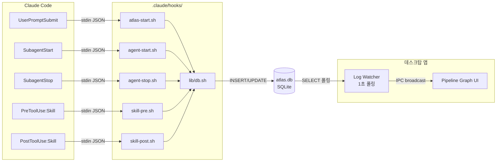
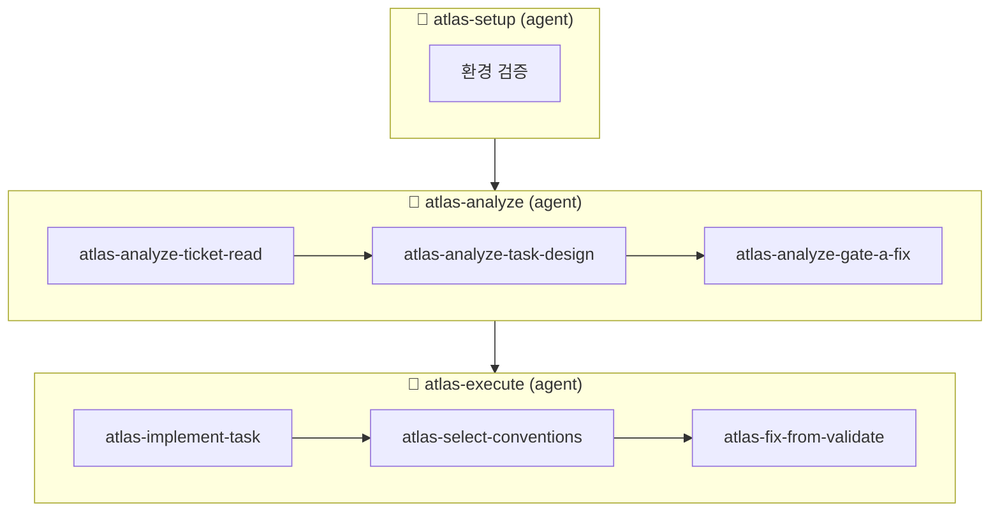
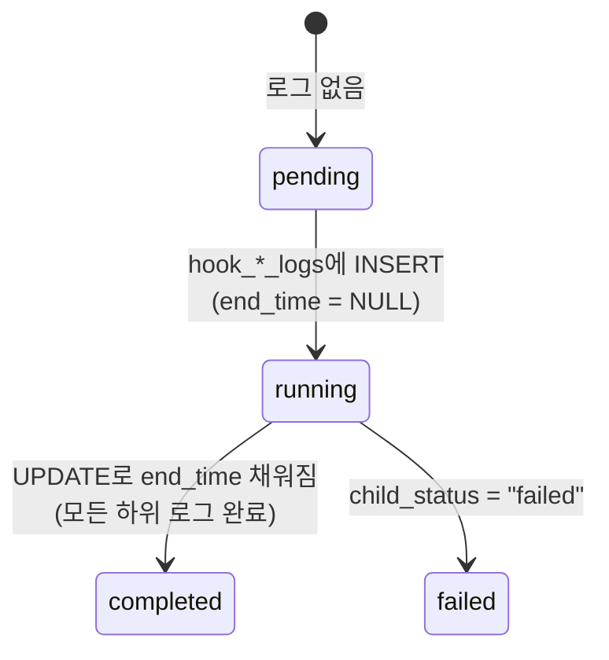
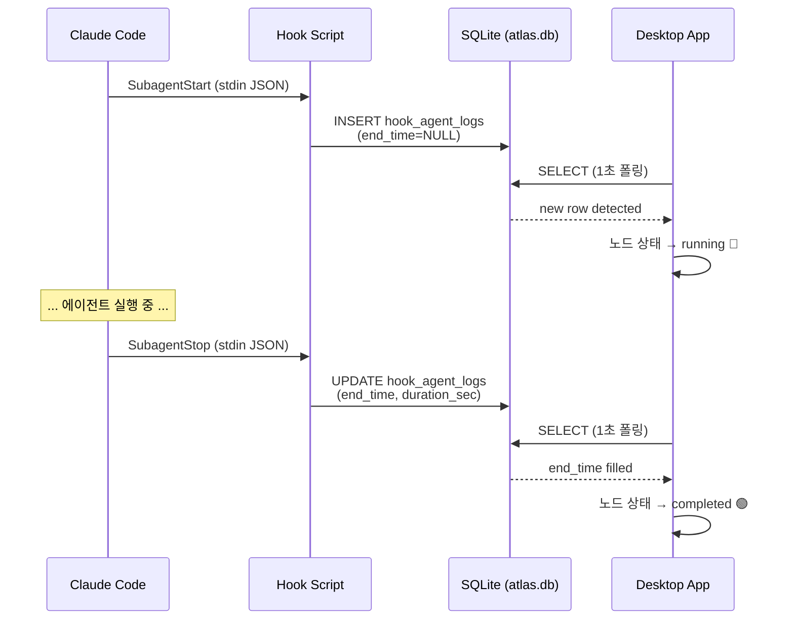

# Atlas Monitoring Desktop — 설정 가이드

Claude Code의 Hook 시스템을 이용해 에이전트/스킬 실행을 실시간으로 모니터링하는 데스크탑 앱이다.
이 문서는 **모니터링이 동작하기 위한 Claude Code 쪽 설정 방법**만 다룬다.

---

## 목차

0. [실행 방법](#실행-방법)
1. [전체 구조](#전체-구조)
2. [파이프라인 JSON 정의](#1-파이프라인-json-정의)
3. [Hook 스크립트 작성](#2-hook-스크립트-작성)
4. [settings.json 구성](#3-settingsjson-구성)
5. [SQLite DB 헬퍼](#4-sqlite-db-헬퍼)
6. [전체 예시](#전체-예시)
7. [데이터 흐름 다이어그램](#데이터-흐름-다이어그램)

---

## 실행 방법

```bash
# 의존성 설치
pnpm install

# 개발 모드 실행
pnpm --filter desktop dev

# 타입 체크
pnpm --filter desktop typecheck

# 프로덕션 빌드
pnpm --filter desktop build
```

---

## 전체 구조

```
your-project/
├── .claude/
│   ├── settings.json          ← Hook 이벤트 → 스크립트 매핑
│   └── hooks/
│       ├── lib/
│       │   └── db.sh          ← SQLite INSERT/UPDATE 헬퍼
│       ├── atlas-start.sh     ← 세션 시작 기록
│       ├── agent-start.sh     ← 에이전트 시작 기록
│       ├── agent-stop.sh      ← 에이전트 종료 기록
│       ├── skill-pre.sh       ← 스킬 시작 기록
│       └── skill-post.sh      ← 스킬 종료 기록
└── pipeline.json              ← 파이프라인 노드/엣지 정의 (별도 작성 후 앱에서 Import)
```

---

## 1. 파이프라인 JSON 정의

데스크탑 앱이 그래프를 렌더링하려면 파이프라인의 **노드(node)**와 **엣지(edge)** 구조를 JSON 파일로 작성한 뒤, 앱 UI의 **Import 버튼**으로 등록해야 한다.

> 파이프라인 JSON은 파일 경로를 자동 감지하지 않는다.
> 반드시 **데스크탑 앱에서 한 번 Import**해야 내부 DB에 저장되어 사용된다.
> Import 이후에는 앱 실행 시 DB에서 자동 로드된다.

### 스키마

```jsonc
{
  "id": "pipeline-id",        // 고유 식별자
  "name": "표시 이름",
  "nodes": [
    // 최상위 에이전트 노드
    { "id": "my-agent", "type": "agent", "label": "Agent A" },

    // 에이전트 하위 스킬 노드 (parentId로 소속 지정)
    { "id": "my-skill", "type": "skill", "label": "Skill 1", "parentId": "my-agent" }
  ],
  "edges": [
    // 노드 간 실행 순서
    { "source": "node-a", "target": "node-b" }
  ]
}
```

### 필드 설명

| 필드 | 타입 | 설명 |
|------|------|------|
| `nodes[].id` | `string` | Claude Code의 `agent_type` 또는 `skill` 이름과 **정확히 일치**해야 한다 |
| `nodes[].type` | `"agent" \| "skill"` | `agent`: SubagentStart/Stop 훅으로 추적, `skill`: PreToolUse/PostToolUse 훅으로 추적 |
| `nodes[].label` | `string` | UI에 표시되는 이름 |
| `nodes[].parentId` | `string?` | skill 노드는 반드시 소속 agent의 id를 지정 |
| `edges[].source/target` | `string` | 실행 순서를 표현하는 방향 간선 |

### 핵심 규칙

- **`nodes[].id`는 Claude Code가 보내는 이벤트의 이름과 동일해야 한다.**
  - 에이전트 → `agent_type` 값 (예: Agent tool의 `subagent_type`)
  - 스킬 → `skill` 이름 (예: Skill tool에 전달하는 `skill` 파라미터)
- skill 노드는 반드시 `parentId`를 가져야 한다. 없으면 그래프에서 독립 노드가 된다.
- 에이전트 간 엣지와 스킬 간 엣지를 모두 정의하면 계층적 그래프가 만들어진다.

### 실제 예시

```json
{
  "id": "atlas-pipeline-v5",
  "name": "Atlas v5 Pipeline",
  "nodes": [
    { "id": "atlas-setup",    "type": "agent", "label": "Setup" },
    { "id": "atlas-analyze",  "type": "agent", "label": "Analyze" },
    { "id": "atlas-execute",  "type": "agent", "label": "Execute" },

    { "id": "atlas-analyze-ticket-read",  "type": "skill", "label": "Ticket Read",       "parentId": "atlas-analyze" },
    { "id": "atlas-analyze-task-design",  "type": "skill", "label": "Task Design",       "parentId": "atlas-analyze" },
    { "id": "atlas-analyze-gate-a-fix",   "type": "skill", "label": "Gate A Review/Fix", "parentId": "atlas-analyze" },

    { "id": "atlas-implement-task",       "type": "skill", "label": "Implement",          "parentId": "atlas-execute" },
    { "id": "atlas-select-conventions",   "type": "skill", "label": "Select Conventions", "parentId": "atlas-execute" },
    { "id": "atlas-fix-from-validate",    "type": "skill", "label": "Fix From Validate",  "parentId": "atlas-execute" }
  ],
  "edges": [
    { "source": "atlas-setup",   "target": "atlas-analyze" },
    { "source": "atlas-analyze", "target": "atlas-execute" },

    { "source": "atlas-analyze-ticket-read", "target": "atlas-analyze-task-design" },
    { "source": "atlas-analyze-task-design", "target": "atlas-analyze-gate-a-fix" },

    { "source": "atlas-implement-task",      "target": "atlas-select-conventions" },
    { "source": "atlas-select-conventions",  "target": "atlas-fix-from-validate" }
  ]
}
```

---

## 2. Hook 스크립트 작성

Claude Code는 특정 이벤트 발생 시 stdin으로 JSON을 전달하며 등록된 셸 스크립트를 실행한다.
모니터링에 필요한 훅은 **5개**다.

### 2-1. 세션 시작 (`atlas-start.sh`)

**이벤트**: `UserPromptSubmit` — 사용자가 프롬프트를 제출할 때 발생

stdin으로 들어오는 JSON:
```json
{
  "session_id": "abc-123",
  "prompt": "/atlas GRID-2 --force",
  "cwd": "/path/to/project"
}
```

스크립트가 할 일:
- `prompt`가 모니터링 대상 커맨드인지 필터링 (예: `/atlas`로 시작하는지)
- `atlas_sessions` 테이블에 세션 레코드 INSERT

```bash
#!/bin/bash
set -e
HOOK_DIR="$(cd "$(dirname "${BASH_SOURCE[0]}")" && pwd)"
source "${HOOK_DIR}/lib/db.sh"

INPUT=$(cat)
PROMPT=$(echo "$INPUT" | jq -r '.prompt // ""')

# 모니터링 대상이 아니면 무시
if [[ "$PROMPT" != /atlas* ]]; then
  exit 0
fi

SESSION_ID=$(echo "$INPUT" | jq -r '.session_id // "unknown"')
CWD=$(echo "$INPUT" | jq -r '.cwd // "unknown"')
ARGS=$(echo "$PROMPT" | sed 's|^/atlas[[:space:]]*||')
TIMESTAMP=$(date '+%Y-%m-%dT%H:%M:%S%z')

db_insert_session "$SESSION_ID" "$TIMESTAMP" "$ARGS" "$CWD"
exit 0
```

### 2-2. 에이전트 시작 (`agent-start.sh`)

**이벤트**: `SubagentStart` — 서브에이전트가 생성될 때 발생

stdin JSON:
```json
{
  "session_id": "abc-123",
  "agent_id": "agent-uuid-456",
  "agent_type": "atlas-setup",
  "cwd": "/path/to/project",
  "permission_mode": "default"
}
```

스크립트가 할 일:
- `hook_agent_logs` 테이블에 `end_time=NULL`인 레코드 INSERT (실행 중 표시)

```bash
#!/bin/bash
set -e
HOOK_DIR="$(cd "$(dirname "${BASH_SOURCE[0]}")" && pwd)"
source "${HOOK_DIR}/lib/db.sh"

INPUT=$(cat)
AGENT_ID=$(echo "$INPUT" | jq -r '.agent_id // "unknown"')
AGENT_TYPE=$(echo "$INPUT" | jq -r '.agent_type // "unknown"')
SESSION_ID=$(echo "$INPUT" | jq -r '.session_id // "unknown"')
CWD=$(echo "$INPUT" | jq -r '.cwd // "unknown"')
PERMISSION_MODE=$(echo "$INPUT" | jq -r '.permission_mode // "unknown"')
TIMESTAMP=$(date '+%Y-%m-%dT%H:%M:%S%z')

db_start_agent_log "$SESSION_ID" "$AGENT_ID" "$AGENT_TYPE" "$CWD" "$PERMISSION_MODE" "$TIMESTAMP"
exit 0
```

### 2-3. 에이전트 종료 (`agent-stop.sh`)

**이벤트**: `SubagentStop` — 서브에이전트가 완료될 때 발생

stdin JSON:
```json
{
  "session_id": "abc-123",
  "agent_id": "agent-uuid-456",
  "agent_type": "atlas-setup",
  "cwd": "/path/to/project",
  "agent_transcript_path": "/path/to/transcript.json",
  "last_assistant_message": "Setup 완료"
}
```

스크립트가 할 일:
- start 훅이 INSERT한 레코드의 `start_time`을 읽어 `duration_sec` 계산
- `end_time`, `duration_sec`, `last_message`로 UPDATE

```bash
#!/bin/bash
set -e
HOOK_DIR="$(cd "$(dirname "${BASH_SOURCE[0]}")" && pwd)"
source "${HOOK_DIR}/lib/db.sh"

INPUT=$(cat)
AGENT_ID=$(echo "$INPUT" | jq -r '.agent_id // "unknown"')
END_TIMESTAMP=$(date '+%Y-%m-%dT%H:%M:%S%z')
END_EPOCH=$(date '+%s')
LAST_MESSAGE=$(echo "$INPUT" | jq -r '.last_assistant_message // ""')

# start 레코드에서 시작 시간 조회 → duration 계산
START_TIMESTAMP=$(db_exec "SELECT start_time FROM hook_agent_logs WHERE agent_id='${AGENT_ID}' LIMIT 1;" 2>/dev/null || echo "")
if [ -n "$START_TIMESTAMP" ]; then
  START_EPOCH=$(date -j -f '%Y-%m-%dT%H:%M:%S%z' "$START_TIMESTAMP" '+%s' 2>/dev/null || echo "$END_EPOCH")
else
  START_EPOCH=$END_EPOCH
fi
DURATION=$(( END_EPOCH - START_EPOCH ))

db_finish_agent_log "$AGENT_ID" "$END_TIMESTAMP" "$DURATION" "" "$LAST_MESSAGE"
exit 0
```

### 2-4. 스킬 시작 (`skill-pre.sh`)

**이벤트**: `PreToolUse` (matcher: `Skill`) — Skill 도구 호출 직전

stdin JSON:
```json
{
  "session_id": "abc-123",
  "tool_use_id": "tool-uuid-789",
  "tool_input": {
    "skill": "atlas-analyze-ticket-read",
    "args": "GRID-2"
  },
  "agent_id": "agent-uuid-456",
  "agent_type": "atlas-analyze",
  "cwd": "/path/to/project",
  "permission_mode": "default"
}
```

스크립트가 할 일:
- `hook_skill_logs` 테이블에 `end_time=NULL`인 레코드 INSERT
- `/tmp` 에 시작 시간 마커 파일 생성 (post 훅에서 duration 계산용)

```bash
#!/bin/bash
set -e
HOOK_DIR="$(cd "$(dirname "${BASH_SOURCE[0]}")" && pwd)"
source "${HOOK_DIR}/lib/db.sh"

INPUT=$(cat)
SESSION_ID=$(echo "$INPUT" | jq -r '.session_id // "unknown"')
TOOL_USE_ID=$(echo "$INPUT" | jq -r '.tool_use_id // "unknown"')
SKILL_NAME=$(echo "$INPUT" | jq -r '.tool_input.skill // "unknown"')
SKILL_ARGS=$(echo "$INPUT" | jq -r '.tool_input.args // ""')
CWD=$(echo "$INPUT" | jq -r '.cwd // "unknown"')
PERMISSION_MODE=$(echo "$INPUT" | jq -r '.permission_mode // "unknown"')
CALLER_AGENT_ID=$(echo "$INPUT" | jq -r '.agent_id // ""')
CALLER_AGENT_TYPE=$(echo "$INPUT" | jq -r '.agent_type // ""')
TIMESTAMP=$(date '+%Y-%m-%dT%H:%M:%S%z')

db_start_skill_log "$SESSION_ID" "$TOOL_USE_ID" "$SKILL_NAME" "$SKILL_ARGS" \
  "$CWD" "$PERMISSION_MODE" "$CALLER_AGENT_ID" "$CALLER_AGENT_TYPE" "$TIMESTAMP"

# post 훅에서 duration 계산을 위한 시작 시간 마커
MARKER_DIR="/tmp/atlas-skill-markers"
mkdir -p "$MARKER_DIR"
echo "{\"start_time\":\"$TIMESTAMP\"}" > "${MARKER_DIR}/${TOOL_USE_ID}.json"

exit 0
```

### 2-5. 스킬 종료 (`skill-post.sh`)

**이벤트**: `PostToolUse` (matcher: `Skill`) — Skill 도구 호출 완료 직후

stdin JSON:
```json
{
  "session_id": "abc-123",
  "tool_use_id": "tool-uuid-789",
  "tool_input": {
    "skill": "atlas-analyze-ticket-read",
    "args": "GRID-2"
  },
  "tool_response": "{ ... result ... }",
  "agent_id": "agent-uuid-456",
  "agent_type": "atlas-analyze",
  "cwd": "/path/to/project"
}
```

스크립트가 할 일:
- pre 훅의 마커 파일에서 시작 시간 읽기 → duration 계산
- `hook_skill_logs` 레코드를 `end_time`, `duration_sec`, `result`로 UPDATE

```bash
#!/bin/bash
set -e
HOOK_DIR="$(cd "$(dirname "${BASH_SOURCE[0]}")" && pwd)"
source "${HOOK_DIR}/lib/db.sh"

INPUT=$(cat)
TOOL_USE_ID=$(echo "$INPUT" | jq -r '.tool_use_id // "unknown"')
SKILL_NAME=$(echo "$INPUT" | jq -r '.tool_input.skill // "unknown"')
TOOL_RESPONSE=$(echo "$INPUT" | jq -r '.tool_response // ""')

# pre 마커에서 시작 시간 읽기
MARKER_FILE="/tmp/atlas-skill-markers/${TOOL_USE_ID}.json"
START_TIMESTAMP=$(date '+%Y-%m-%dT%H:%M:%S%z')
if [ -f "$MARKER_FILE" ]; then
  START_TIMESTAMP=$(jq -r '.start_time' "$MARKER_FILE")
  rm -f "$MARKER_FILE"
fi

END_TIMESTAMP=$(date '+%Y-%m-%dT%H:%M:%S%z')
EPOCH=$(date '+%s')
START_EPOCH=$(date -j -f '%Y-%m-%dT%H:%M:%S%z' "$START_TIMESTAMP" '+%s' 2>/dev/null || echo "$EPOCH")
DURATION=$(( EPOCH - START_EPOCH ))

db_finish_skill_log "$TOOL_USE_ID" "$END_TIMESTAMP" "$DURATION" "$TOOL_RESPONSE"
exit 0
```

---

## 3. settings.json 구성

`.claude/settings.json`에서 각 이벤트를 훅 스크립트에 매핑한다.

```json
{
  "hooks": {
    "UserPromptSubmit": [
      {
        "matcher": "",
        "hooks": [
          {
            "type": "command",
            "command": "$CLAUDE_PROJECT_DIR/.claude/hooks/atlas-start.sh",
            "timeout": 10
          }
        ]
      }
    ],
    "PreToolUse": [
      {
        "matcher": "Skill",
        "hooks": [
          {
            "type": "command",
            "command": "$CLAUDE_PROJECT_DIR/.claude/hooks/skill-pre.sh",
            "timeout": 10
          }
        ]
      }
    ],
    "PostToolUse": [
      {
        "matcher": "Skill",
        "hooks": [
          {
            "type": "command",
            "command": "$CLAUDE_PROJECT_DIR/.claude/hooks/skill-post.sh",
            "timeout": 10
          }
        ]
      }
    ],
    "SubagentStart": [
      {
        "matcher": "atlas-.*",
        "hooks": [
          {
            "type": "command",
            "command": "$CLAUDE_PROJECT_DIR/.claude/hooks/agent-start.sh",
            "timeout": 10
          }
        ]
      }
    ],
    "SubagentStop": [
      {
        "matcher": "atlas-.*",
        "hooks": [
          {
            "type": "command",
            "command": "$CLAUDE_PROJECT_DIR/.claude/hooks/agent-stop.sh",
            "timeout": 10
          }
        ]
      }
    ]
  }
}
```

### 이벤트-훅 매핑 요약

| 이벤트 | matcher | 실행 스크립트 | 용도 |
|--------|---------|--------------|------|
| `UserPromptSubmit` | `""` (전체) | `atlas-start.sh` | 세션 시작 기록 |
| `SubagentStart` | `atlas-.*` | `agent-start.sh` | 에이전트 시작 (running 상태) |
| `SubagentStop` | `atlas-.*` | `agent-stop.sh` | 에이전트 종료 (completed 상태) |
| `PreToolUse` | `Skill` | `skill-pre.sh` | 스킬 시작 (running 상태) |
| `PostToolUse` | `Skill` | `skill-post.sh` | 스킬 종료 (completed 상태) |

### matcher 설명

- `""` — 모든 이벤트에 반응
- `"Skill"` — tool_name이 `Skill`인 경우만 반응
- `"atlas-.*"` — agent_type이 `atlas-`로 시작하는 경우만 반응 (정규식)

---

## 4. SQLite DB 헬퍼

모든 훅 스크립트는 `lib/db.sh`를 통해 SQLite에 직접 기록한다.
데스크탑 앱의 DB 경로는 `~/Library/Application Support/Electron/atlas.db`이다.

```bash
#!/bin/bash
ATLAS_DB="${HOME}/Library/Application Support/Electron/atlas.db"

db_exec() {
  if ! command -v sqlite3 &>/dev/null; then return 0; fi
  if [ ! -f "$ATLAS_DB" ]; then return 0; fi
  sqlite3 "$ATLAS_DB" "$1" 2>/dev/null || true
}

db_insert_session() {
  db_exec "INSERT OR IGNORE INTO atlas_sessions
    (session_id, started_at, args, cwd)
    VALUES ('$1', '$2', '$(echo "$3" | sed "s/'/''/g")', '$4');"
}

db_start_agent_log() {
  db_exec "INSERT OR IGNORE INTO hook_agent_logs
    (session_id, agent_id, agent_type, cwd, permission_mode, start_time)
    VALUES ('$1', '$2', '$3', '$4', '$5', '$6');"
}

db_finish_agent_log() {
  db_exec "UPDATE hook_agent_logs
    SET end_time='$2', duration_sec=$3, transcript_path='$4',
        last_message='$(echo "$5" | sed "s/'/''/g")'
    WHERE agent_id='$1';"
}

db_start_skill_log() {
  db_exec "INSERT OR IGNORE INTO hook_skill_logs
    (session_id, tool_use_id, skill, args, cwd, permission_mode,
     caller_agent_id, caller_agent_type, start_time)
    VALUES ('$1', '$2', '$3', '$(echo "$4" | sed "s/'/''/g")',
            '$5', '$6', '$7', '$8', '$9');"
}

db_finish_skill_log() {
  db_exec "UPDATE hook_skill_logs
    SET end_time='$2', duration_sec=$3,
        result='$(echo "$4" | sed "s/'/''/g")'
    WHERE tool_use_id='$1';"
}
```

### DB 테이블 구조

```sql
-- 세션
atlas_sessions (
  session_id TEXT UNIQUE,   -- Claude Code 세션 ID
  started_at TEXT,          -- ISO 타임스탬프
  args TEXT,                -- 커맨드 인자 (예: "GRID-2 --force")
  cwd TEXT                  -- 작업 디렉토리
)

-- 에이전트 로그
hook_agent_logs (
  agent_id TEXT UNIQUE,     -- 에이전트 인스턴스 ID
  session_id TEXT,          -- 소속 세션
  agent_type TEXT,          -- 파이프라인 node.id와 매칭 (예: "atlas-setup")
  start_time TEXT,          -- 시작 시간
  end_time TEXT,            -- NULL이면 실행 중, 값이 있으면 완료
  duration_sec INTEGER,     -- 실행 시간 (초)
  last_message TEXT         -- 마지막 응답 메시지
)

-- 스킬 로그
hook_skill_logs (
  tool_use_id TEXT UNIQUE,  -- 도구 호출 ID
  session_id TEXT,          -- 소속 세션
  skill TEXT,               -- 파이프라인 node.id와 매칭 (예: "atlas-analyze-ticket-read")
  args TEXT,                -- 스킬 인자
  caller_agent_id TEXT,     -- 호출한 에이전트 ID
  caller_agent_type TEXT,   -- 호출한 에이전트 타입
  start_time TEXT,          -- 시작 시간
  end_time TEXT,            -- NULL이면 실행 중
  duration_sec INTEGER,     -- 실행 시간 (초)
  result TEXT               -- 스킬 실행 결과
)
```

---

## 5. 전체 예시

`/atlas GRID-2 --force` 실행 시 모니터링 데이터가 쌓이는 과정:

### 시간순 이벤트 흐름

```
T=0s   UserPromptSubmit → atlas-start.sh
       → atlas_sessions INSERT (session_id, args="GRID-2 --force")

T=1s   SubagentStart(atlas-setup) → agent-start.sh
       → hook_agent_logs INSERT (agent_type="atlas-setup", end_time=NULL)
       ↳ 데스크탑: Setup 노드 → 🔵 running

T=15s  SubagentStop(atlas-setup) → agent-stop.sh
       → hook_agent_logs UPDATE (end_time=..., duration_sec=14)
       ↳ 데스크탑: Setup 노드 → 🟢 completed

T=16s  SubagentStart(atlas-analyze) → agent-start.sh
       → hook_agent_logs INSERT (agent_type="atlas-analyze", end_time=NULL)
       ↳ 데스크탑: Analyze 노드 → 🔵 running

T=17s  PreToolUse(Skill: atlas-analyze-ticket-read) → skill-pre.sh
       → hook_skill_logs INSERT (skill="atlas-analyze-ticket-read", end_time=NULL)
       ↳ 데스크탑: Ticket Read 스킬 → 🔵 running

T=30s  PostToolUse(Skill: atlas-analyze-ticket-read) → skill-post.sh
       → hook_skill_logs UPDATE (end_time=..., duration_sec=13)
       ↳ 데스크탑: Ticket Read 스킬 → 🟢 completed

T=31s  PreToolUse(Skill: atlas-analyze-task-design) → skill-pre.sh
       → hook_skill_logs INSERT (skill="atlas-analyze-task-design")
       ↳ 데스크탑: Task Design 스킬 → 🔵 running

       ... (이하 동일 패턴)
```

### 데스크탑 UI 상태 변화

| 시점 | Setup | Analyze | Execute |
|------|-------|---------|---------|
| T=0s | ⚪ pending | ⚪ pending | ⚪ pending |
| T=1s | 🔵 running | ⚪ pending | ⚪ pending |
| T=15s | 🟢 completed | ⚪ pending | ⚪ pending |
| T=16s | 🟢 completed | 🔵 running | ⚪ pending |
| T=60s | 🟢 completed | 🟢 completed | 🔵 running |
| T=120s | 🟢 completed | 🟢 completed | 🟢 completed |

---

## 데이터 흐름 다이어그램

### 전체 아키텍처



### 파이프라인 실행 순서



### 노드 상태 결정 로직



### Hook 이벤트 → DB 레코드 매핑



---

## 체크리스트

새 프로젝트에 모니터링을 연동할 때 확인할 항목:

- [ ] 데스크탑 앱을 한 번 이상 실행하여 `atlas.db` 테이블이 생성됐는가
- [ ] 파이프라인 JSON 파일을 작성하고 **앱 UI의 Import 버튼으로 등록**했는가
- [ ] `.claude/hooks/` 디렉토리에 5개 스크립트가 존재하고 실행 권한(`chmod +x`)이 있는가
- [ ] `.claude/hooks/lib/db.sh`의 `ATLAS_DB` 경로가 데스크탑 앱의 DB 경로와 일치하는가
- [ ] `.claude/settings.json`에 5개 이벤트-훅 매핑이 모두 등록됐는가
- [ ] 파이프라인 JSON의 `nodes[].id`가 Claude Code의 `agent_type`/`skill` 이름과 정확히 일치하는가
- [ ] `jq`와 `sqlite3`가 시스템에 설치돼 있는가
- [ ] settings.json의 `matcher` 정규식이 모니터링 대상 에이전트/스킬을 정확히 매칭하는가
